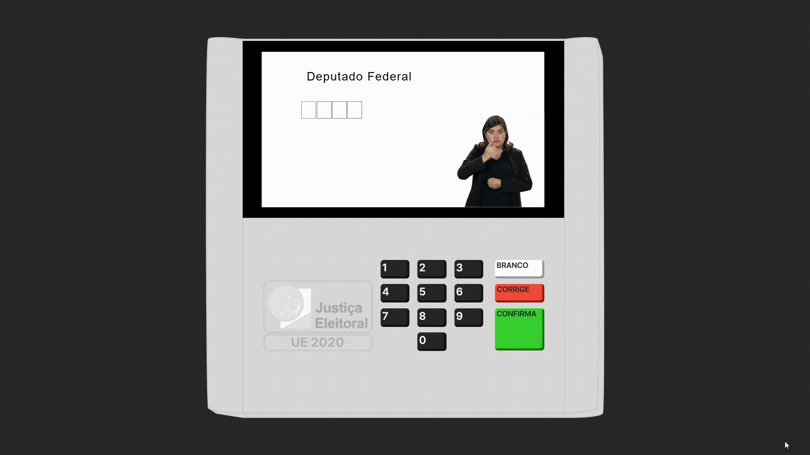

  
  <h1>🚀 Urna Eletrônica 🚀</h1>

## 📚 Sobre

Simulador web totalmente funcional da **Nova Urna Eletrônica** que foi utilizada pela primeira vez nas Eleições Brasileiras de 2022.

## 🏗️ Desenvolvimento

Desenvolvido somente para a web, com as tecnologias mais avançadas da atualidade. Inspirada no simulador original da **Urna Eletrônica** do [Tribunal de Justiça Eleitoral](https://www.tse.jus.br/hotsites/simulador-de-votacao/depFederal.html) do Brasil.

## 🕹️ Possui as seguintes funcionalidades:

- Sons originais da urna eletrônica
- Design de alta fidelidade do modelo original da urna eletrônica
- Possui candidatos fictícios para uso, os mesmos do simulador oficial da **Justiça Eleitoral**
- Inserir **dígitos** de **0-9** para buscar e selecionar um candidato
- **Reiniciar** o voto atual, através da tecla **CORRIGIR**
- **Confirmar** um voto, através da tecla **CONFIRMA**, para passar para o próximo cargo político a ser votado
- Usar **Voto de Legenda**, quando o eleitor decide votar em um partido ao invés de um candidato
- Votar **Nulo**, quando o candidato e o partido escolhidos pelo eleitor são inválidos
- Votar em **Branco**, através da tecla **BRANCO**, quando o eleitor decide não votar em nenhum candidato
- Votar em um candidato **Válido**, seja ele:
  - Deputado Federal
  - Deputado Estadual
  - Senador
  - Governador
  - Presidente

## 📝 Notas

O design visual desta Urna Eletrônica não é de minha autoria, ele pertence a ✨ **[Matheus do Carmo](https://www.linkedin.com/in/matheusndc/)** ✨ e foi obtido por mim gratuitamente na comunidade do [Figma](https://www.figma.com/community/search?model_type=hub_files&q=urna%20eletr%C3%B4nica). Gostaria de agradecê-lo pelo trabalho, pois sem este design o projeto não seria o que é atualmente.

## 🔎 Demonstração

  

## 💻 Como acessar

A aplicação está hospedada na **Vercel** e pode ser acessada [aqui](https://urna-eletronica-three.vercel.app/).

## 🛠️ Tecnologias utilizadas

 

<table align="center">
  <tbody>
    <tr>
      <td align="center" width="110" height="110">
        
         
        HTML
      </td>
      <td align="center" width="110" height="110">
        
         
        CSS
      </td>
      <td align="center" width="110" height="110">
        
         
        JavaScript
      </td>
      <td align="center" width="110" height="110">
        
         
        React
      </td>
    </tr>
    <tr>
      <td align="center" width="110" height="110">
        
         
        Redux
      </td>
      <td align="center" width="110" height="110">
        
         
        TailwindCSS
      </td>
      <td align="center" width="110" height="110">
        
         
        TypeScript
      </td>
      <td align="center" width="110" height="110">
        
         
        Next
      </td>
    </tr>
  </tbody>
</table>

 

✨ Made with 💙 by <a href="https://github.com/riandeoliveira"><strong>Rian Oliveira</strong></a> ✨

